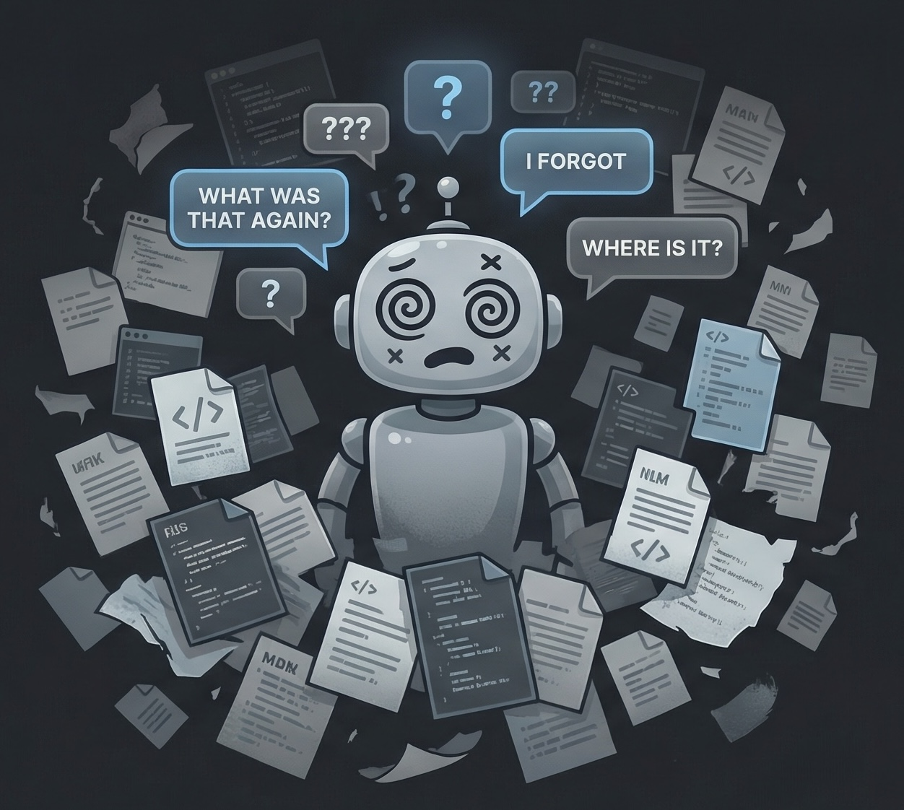

# Lavra (/ˈla.vɾɐ/ — Portuguese for "harvest")

[](LICENSE)
[](https://github.com/roberto-mello/lavra/releases)
[](https://github.com/steveyegge/beads)

**Lavra turns your AI coding agent into a development team that gets smarter with every task.**

A plugin for coding agents that orchestrates the full development lifecycle -- from brainstorming to shipping -- while automatically capturing and recalling knowledge so each unit of work makes the next one easier.

[](https://docs.anthropic.com/en/docs/claude-code)
[](https://opencode.ai/)
[](https://github.com/google-gemini/gemini-cli)
[](https://www.snowflake.com/en/product/features/cortex-code/)

**[Quick Start](https://lavra.dev/docs/quickstart)** | **[Full Catalog](https://lavra.dev/docs/catalog)** | **[Architecture](https://lavra.dev/docs/architecture)** | **[Security](https://lavra.dev/docs/security)** | **[Command Map](https://lavra.dev/command-map)** | **[v0.7.7 Release Notes](https://lavra.dev/docs/releases/v0.7.7)**

<table>
<tr>
<td width="65%">

### Without Lavra

- The agent forgets everything between sessions -- you re-explain context every time
- Planning is shallow: it jumps to code before thinking through the problem
- Review is inconsistent: sometimes thorough, sometimes a rubber stamp
- Knowledge stays in your head. When a teammate hits the same bug, they start from zero
- Shipping is manual: you run tests, create the PR, close tickets, push -- every time

</td>
<td width="35%" align="center">

</td>
</tr>
</table>

<table>
<tr>
<td width="65%">

### With Lavra

- **Automatic memory.** Knowledge is captured inline during work and recalled automatically at the start of every session. Hit the same OAuth bug next month? The agent already knows the fix.
- **Structured planning.** Brainstorm with scope sharpening, research with domain-matched agents, adversarial plan review -- all before a single line of code is written.
- **Disciplined execution.** Agents follow deviation rules (what to auto-fix vs. escalate), commit per task with traceable bead IDs, and verify every success criterion before marking work done.
- **Built-in quality gates.** Every implementation runs through a review-fix-learn loop. Knowledge capture is mandatory, not optional.
- **Team-shareable knowledge.** Memory lives in `.lavra/memory/knowledge.jsonl`, tracked by git. Your team compounds knowledge together.

</td>
<td width="35%" align="center">

</td>
</tr>
</table>

## The workflow

Most of the time, you type three commands:

```
/lavra-design "I want users to upload photos for listings"
```

This runs the full planning pipeline as a single command: interactive brainstorm with scope sharpening, structured plan with phased beads, domain-matched research agents, plan revision, and adversarial review. The output is detailed enough that implementation is mechanical.

```
/lavra-work
```

Picks up the approved plan and implements it. Auto-routes between single and multi-bead parallel execution. Includes mandatory review, fix loop, and knowledge curation -- all automatic.

```
/lavra-ship
```

Rebases on main, runs tests, scans for secrets and debug leftovers, creates the PR, closes beads, and pushes the backup. One command to land the plane.

Add `/lavra-qa` between work and ship when building web apps -- it maps changed files to routes and runs browser-based verification with screenshots.

## Who this is for

Anyone using coding agents who wants consistent, high-quality output instead of hoping the agent gets it right this time.

- **Non-technical users:** `/lavra-design "build me X"` handles the brainstorming, planning, and research. `/lavra-work` handles the implementation with built-in quality gates. You get working software without needing to know how to code.
- **Solo developers:** The memory system acts as a second brain. Past decisions, patterns, and gotchas surface automatically when they're relevant.
- **Teams:** Knowledge compounds across contributors. One person's hard-won insight becomes everyone's starting context.

## Install

**Requires:** [beads CLI](https://github.com/steveyegge/beads), `jq`, `sqlite3`

```bash
npx @lavralabs/lavra@latest
```

Or manual:

```bash
git clone https://github.com/roberto-mello/lavra.git
cd lavra
./install.sh               # Claude Code (default)
./install.sh --opencode    # OpenCode
./install.sh --gemini      # Gemini CLI
./install.sh --cortex      # Cortex Code
```

<details>
<summary><strong>All commands</strong></summary>

**Pipeline (4):** `/lavra-design`, `/lavra-work`, `/lavra-qa`, `/lavra-ship`

**Supporting (9):** `/lavra-quick` (fast path with escalation), `/lavra-learn` (knowledge curation), `/lavra-recall` (mid-session search), `/lavra-checkpoint` (save progress), `/lavra-retro` (weekly analytics), `/lavra-import`, `/lavra-triage`, `/changelog`, `/test-browser`

**Power-user (6):** `/lavra-plan`, `/lavra-research`, `/lavra-eng-review`, `/lavra-review` (15 specialized review agents), `/lavra-work-ralph` (autonomous retry), `/lavra-work-teams` (persistent workers)

**30 specialized agents** across review, research, design, workflow, and docs. Each runs at the right model tier to keep costs 60-70% lower than running everything on Opus.

See [docs/CATALOG.md](docs/CATALOG.md) for the full listing.

</details>

## How knowledge compounds

```
brainstorm  --DECISION-->  design
design      <--LEARNED/PATTERN--  auto-recall from prior work
research    --FACT/INVESTIGATION-->  plan revision
work        --LEARNED (inline)-->  mandatory knowledge gate
review      --LEARNED-->  issues become future recall
retro       synthesizes patterns, surfaces gaps
```

Six knowledge types (LEARNED, DECISION, FACT, PATTERN, INVESTIGATION, DEVIATION) are captured inline during work and stored in `.lavra/memory/knowledge.jsonl`. At session start, relevant entries are recalled automatically based on your current beads and git branch. The system gets smarter over time -- not just for you, but for your whole team.

### Configuration

**`.lavra/config/lavra.json`** can be created manually or by the `/lavra-setup` command.
It allows users to toggle workflow phases, planning and execution behavior:

```jsonc
{
  "workflow": {
    "research": true,             // run research agents in /lavra-design
    "plan_review": true,          // run plan review phase in /lavra-design
    "goal_verification": true,    // verify completion criteria in /lavra-work and /lavra-ship
    "testing_scope": "targeted"   // "targeted" (hooks, API routes, complex logic only) or "full" (all tests)
  },
  "execution": {
    "max_parallel_agents": 3,     // max subagents running at once
    "commit_granularity": "task"  // "task" (atomic, default) or "wave" (legacy)
  },
  "model_profile": "balanced"     // "balanced" (default) or "quality" (opus for review/verification agents)
}
```

**`/lavra-setup`**: run this to generate a codebase profile (stack, architecture, conventions) that informs planning.

## Acknowledgments

Built by [Roberto Mello](https://github.com/roberto-mello), extending [compound-engineering](https://github.com/EveryInc/compound-engineering-plugin) by [Every](https://every.to). Task tracking by [Beads](https://github.com/steveyegge/beads).

Inspired by Every's writing on [compound engineering](https://every.to/chain-of-thought/compound-engineering-how-every-codes-with-agents), with ideas from [Mario Zechner](https://x.com/badlogicgames/), [Simon Willison](https://https://simonwillison.net/), [Get Shit Done](https://github.com/gsd-build/get-shit-done), [gstach by Garry Tan](https://github.com/garrytan/gstack) and many others. Thanks to my friend Dan for rubber-ducking Lavra.

---

_Lavra (/ˈla.vɾɐ/) is the Portuguese word for "harvest" — the idea that every session plants knowledge that the next one reaps. Named by Roberto Mello, who is Brazilian._
